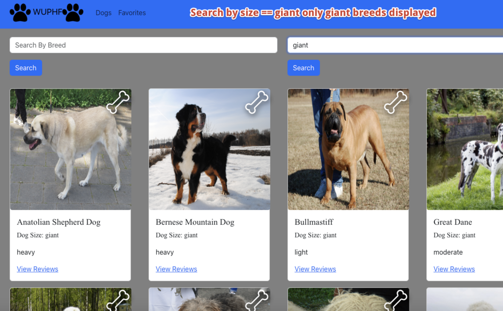
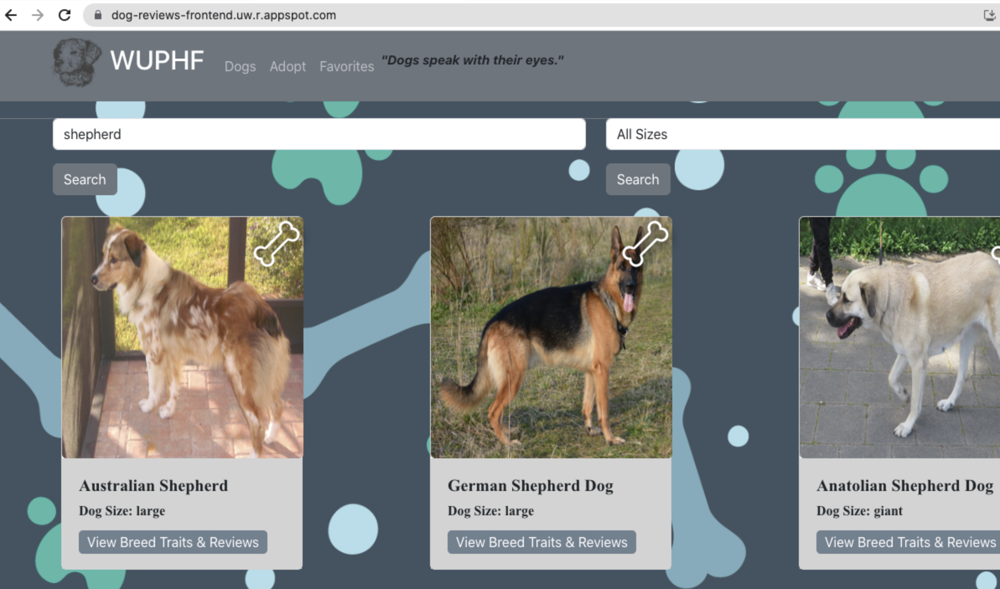

## Title:
 
Dog Review Web App

## Overview:

This project was created for my team's final project for a Web App Development course. The web app is a dog review website where users can view various breeds of dogs and leave a review. We utilized Git to manage version control and frequent communication and discussion for the direction of our website.

My role was in implementing the backend including APIs and DAOs to properly pull data from the database.

## Screenshots

<b>First Iteration</b>

<b>Final Result</b>

